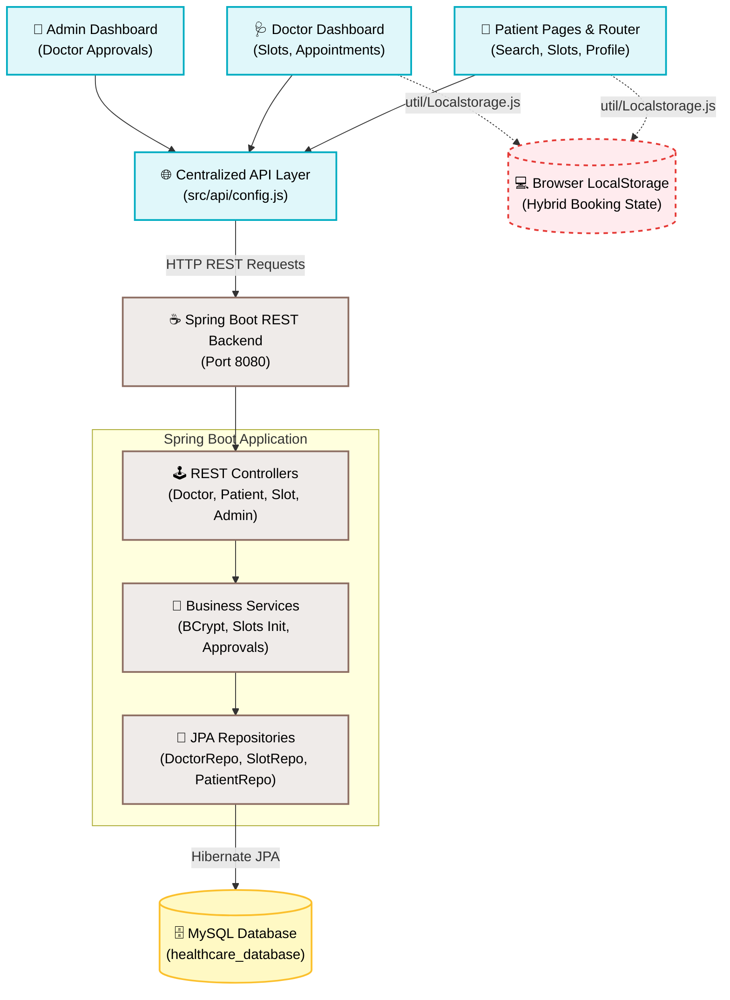

# 🩺 DrMeet — Premium Doctor Appointment System

[](https://spring.io/projects/spring-boot)
[](https://react.dev/)
[](https://www.mysql.com/)
[](https://tailwindcss.com/)
[](LICENSE)

DrMeet is a state-of-the-art, full-stack healthcare scheduling and doctor appointment booking platform designed to streamline patient consultations, automate slot administration, and separate user, provider, and administrative operational pipelines. 

Built on a robust architecture featuring a modular **React + Vite** frontend, a secure **Spring Boot** REST backend, and persistent **MySQL** storage, DrMeet solves the complexities of medical practice scheduling by implementing strict role-based dashboards, high-fidelity scheduling integrity constraints, and modern user experiences.

---

## 🗺️ System Architecture

DrMeet uses a clean, decoupling-focused multi-tier architecture. It handles primary workflows directly using MySQL-backed backend APIs, while supporting a modern, responsive user experience with localized visual routing.



---

## 🌟 Core Feature Sets

### 👤 Patient Experience
- **Fluid Authenticated Onboarding:** Robust register/login with real-time payload validation (such as 10-digit phone checking).
- **Advanced Provider Discovery:** Filterable multi-doctor directory searching.
- **Smart Date & Time Selectors:** Dynamically browse available slot dates (7-day window) and schedule consultations without collision.
- **Personalized Patient Dashboard:** Track scheduled sessions, view medical fees, and manage account properties.

### 🩺 Doctor Operations
- **Professional Provider Profiles:** Showcase credentials, fees, hospitals, license numbers, and custom profile images.
- **Instant Scheduling Engine:** Automatically initializes **20 default daily slots** (9:00 AM to 7:30 PM) upon onboarding.
- **Operational Dashboards:** Review current appointment rosters and trace appointment data counts.
- **Slot Administration:** Toggle session availability and configure customized booking ranges.

### 🔑 Administrative Control (Admin Module)
- **Gatekept Access:** Separate admin dashboard restricted by sessionStorage guardrails.
- **Provider Approval Workflow:** Moderate registering doctors, transitioning them from `PENDING` to `APPROVED` or `REJECTED`. Unapproved doctors are blocked from logging in or appearing in search results.
- **Comprehensive Registry Audits:** Oversee platform-wide patient and doctor enrollments.

---

## 🛠️ Technology Stack

### Frontend Stack
* **Framework:** React + Vite (Fast HMR & lightweight bundle)
* **Routing:** React Router DOM (Dynamic nested role-based routes)
* **Styling:** Tailwind CSS & Custom CSS (Glassmorphic surfaces, responsive layouts)
* **Animations:** Framer Motion (Smooth page transitions and micro-interactions)
* **Notifications:** React Toastify (Real-time operational alerts)

### Backend Stack
* **Language/Platform:** Java 21 (Modern JDK features)
* **Framework:** Spring Boot (Layered enterprise container)
* **Security:** Spring Security & BCrypt (Industrial-grade password hashing)
* **Persistence:** Spring Data JPA + Hibernate (ORM mapping and query builder)
* **Database:** MySQL 8.x (Relational ACID consistency)
* **Build System:** Maven 3.9+

---

## 📂 Repository Structure

```text
drmeet-doctor-appointment-system/
├── Frontend/                    # React SPA Application
│   ├── src/
│   │   ├── api/                 # Modular Centralized REST Client
│   │   │   ├── config.js        # Base URL & endpoints registry
│   │   │   ├── index.js         # Unified entry exporter
│   │   │   ├── doctorApi/       # Provider fetch wrappers
│   │   │   └── userApi/         # Patient fetch wrappers
│   │   ├── components/          # Reusable UI widgets (Navbar, Footer, DoctorCard)
│   │   ├── pages/               # Routed page directories
│   │   │   ├── auth/            # Onboarding (Login, Registers)
│   │   │   ├── Doctor/          # Dashboard, Appointments, ManageSlots
│   │   │   └── users/           # Landing, Search, Profile, ViewSlots
│   │   ├── util/                # LocalStorage backup engine
│   │   ├── App.jsx              # Routing rules & provider shells
│   │   └── main.jsx             # React system mount
│   └── package.json             # NPM dependencies config
│
└── HealthCare_Backend/          # Spring Boot Application
    ├── src/main/java/.../
    │   ├── Config/              # CORS & Security beans
    │   ├── Controller/          # REST Controllers
    │   ├── Entity/              # Hibernate JPA Entities
    │   ├── Repository/          # Data Repositories (Doctor, Patient, Slot, Admin)
    │   └── Services/            # Business validation logic
    ├── src/main/resources/
    │   └── application.properties # Server port, database and JPA properties
    └── pom.xml                  # Maven dependency manager
```

---

## 🔌 API Reference Contracts

### 🔒 Authentication & Account APIs

| Path | Method | Auth | Body / Params | Description |
| :--- | :--- | :--- | :--- | :--- |
| `/api/patients/register` | `POST` | Public | Patient JSON | Registers new patient, hashes password. |
| `/api/patients/login` | `POST` | Public | Credentials JSON | Verifies patient email & BCrypt password. |
| `/api/patients/get/{email}` | `GET` | Public | *None* | Retrives patient data schema by email. |
| `/api/doctors/register` | `POST` | Public | Doctor JSON | Registers provider (sets to `PENDING` approval, auto-creates slots). |
| `/api/doctors/login` | `POST` | Public | Credentials JSON | Validates email & password (requires `APPROVED` status). |
| `/api/doctors/get/{email}` | `GET` | Public | *None* | Fetches doctor entity detail. |
| `/api/doctors/all` | `GET` | Public | *None* | Lists all approved doctors for search. |
| `/api/doctors/profile-image` | `PUT` | Public | Multipart Image | Updates doctor dashboard profile picture. |

### 🔑 Administrative Control APIs

| Path | Method | Auth | Body / Params | Description |
| :--- | :--- | :--- | :--- | :--- |
| `/api/admin/register` | `POST` | Public | Admin JSON | Registers platform administrator via Postman/Console. |
| `/api/admin/login` | `POST` | Public | Credentials JSON | Authenticates admin session. |
| `/api/admin/all` | `GET` | Admin | *None* | Lists all registered doctors in system. |
| `/api/admin/pending` | `GET` | Admin | *None* | Pulls only `PENDING` registration doctors. |
| `/api/admin/{id}/approve`| `PUT` | Admin | *None* | Approves doctor, allowing them to login & publish. |
| `/api/admin/{id}/reject` | `PUT` | Admin | *None* | Rejects doctor registration. |

### 📅 Booking & Slot Allocation APIs

| Path | Method | Auth | Body / Params | Description |
| :--- | :--- | :--- | :--- | :--- |
| `/api/slots/available/{doctorId}` | `GET` | Public | `date=YYYY-MM-DD` | Pulls unbooked slots for a date. |
| `/api/slots/{doctorId}` | `GET` | Public | `date=YYYY-MM-DD` | Returns all slots (both booked and open) for a date. |
| `/api/slots/range/{doctorId}` | `GET` | Public | `startDate`, `endDate` | Returns slot allocation lists between dates. |
| `/api/slots/book` | `POST` | Public | `doctorId`, `date`, `time`, `userId` | Books slot for patient, setting `isBooked = true`. |
| `/api/slots/cancel/{slotId}` | `PUT` | Public | *None* | Cancels slot, setting `isBooked = false`. |
| `/api/slots/initialize/{doctorId}` | `POST` | Public | `date=YYYY-MM-DD` | Explicitly creates 20 default slots for a custom date. |
| `/api/slots/patient/{userId}` | `GET` | Public | *None* | Returns booking history for a specific patient. |

---

## ⚡ Setup & Launch Instruction

### 1️⃣ Database Setup (MySQL)
1. Open your MySQL client (CLI, Workbench, or phpMyAdmin).
2. Execute the database creation command:
   ```sql
   CREATE DATABASE healthcare_database;
   ```
3. *(Optional)* To run custom DB schemas manually, create the tables using:
   ```sql
   CREATE TABLE slots (
       id BIGINT AUTO_INCREMENT PRIMARY KEY,
       doctor_id BIGINT NOT NULL,
       slot_date DATE NOT NULL,
       slot_time VARCHAR(20) NOT NULL,
       is_booked BOOLEAN DEFAULT FALSE,
       booked_by_user_id BIGINT,
       created_at DATETIME,
       updated_at DATETIME,
       FOREIGN KEY (doctor_id) REFERENCES doctors(id) ON DELETE CASCADE,
       UNIQUE KEY unique_slot (doctor_id, slot_date, slot_time)
   );
   ```
   > [!NOTE]
   > Manual creation is optional. Hibernate will auto-create all database tables upon starting the application if the `spring.jpa.hibernate.ddl-auto` setting is set to `update` in `application.properties`.

---

### 2️⃣ Backend REST Service Deployment
1. Navigate to the backend directory:
   ```bash
   cd HealthCare_Backend
   ```
2. Open `src/main/resources/application.properties` and customize database credentials:
   ```properties
   spring.datasource.url=jdbc:mysql://localhost:3306/healthcare_database?useSSL=false&serverTimezone=UTC
   spring.datasource.username=YOUR_MYSQL_USERNAME
   spring.datasource.password=YOUR_MYSQL_PASSWORD
   ```
3. Run the Spring Boot application using Maven:
   ```bash
   mvn clean spring-boot:run
   ```
   *The backend will boot up at `http://localhost:8080`.*

---

### 3️⃣ Frontend Client Launch
1. Open a new terminal and navigate to the frontend directory:
   ```bash
   cd Frontend
   ```
2. Install npm dependencies:
   ```bash
   npm install
   ```
3. Boot the Vite development server:
   ```bash
   npm run dev
   ```
   *The frontend client will boot up at `http://localhost:5173`.*

---

### 4️⃣ Quickstart Sandbox: Testing the Complete Admin Workflow
For a complete test run of the platform from registrations to bookings:

1. **Create the Administrator Account:**
   Use an API client (like Postman or cURL) to make a registration request:
   ```http
   POST http://localhost:8080/api/admin/register
   Content-Type: application/json

   {
     "fullname": "System Administrator",
     "email": "admin@healthcare.com",
     "password": "AdminPassword@123"
   }
   ```

2. **Register a New Doctor Profile:**
   - Open `http://localhost:5173/DoctorRegister`.
   - Submit the doctor application form.
   - Upon submitting, the system sets the account to `PENDING` status. The interface will notify you that the application is under review.

3. **Moderate & Approve the Doctor:**
   - Navigate to `http://localhost:5173/admin-login`.
   - Sign in using the admin account created in step 1.
   - Locate the doctor under the **PENDING** tab and click **Approve**.

4. **Verify Live Access:**
   - Log in using the newly approved doctor's credentials.
   - Log in as a patient, browse the doctor registry, and book an available slot!

---

## 🛠️ Hybrid Data & Refactoring Details

> [!TIP]
> **Data Strategy Notice:** 
> DrMeet currently uses a hybrid data flow. Onboarding, profile queries, and listings are fully backed by the Spring Boot backend REST API. The slot selection and booking user interfaces are wired to read and write locally using `localStorage` (via `src/util/Localstorage.js`).
> 
> However, a comprehensive database slot engine is fully implemented on the backend in the `SlotEntity`, `SlotService`, and `SlotController` modules. Transitioning the UI to pull slots entirely from `/api/slots/...` represents the core path for next-generation platform consolidation.

### Refactored API Access Layer
In-app calls are routed through a highly modular, decoupled API client architecture located in `src/api`:
* **`config.js`**: Standardizes baseUrl mappings and endpoint names.
* **`doctorApi/index.js`**: Houses all provider integrations.
* **`userApi/index.js`**: Standardizes patient functions.

For clean imports across components, use single destructured statements:
```javascript
import { doctorApi, userApi } from "../api/index";

// Fetching approved listing
const approvedDocs = await doctorApi.getAllDoctors();

// Fetching patient profiles
const profileData = await userApi.getUserProfile(userEmail);
```

---

## 🔮 Future Enhancements & Roadmap
* **JWT Web Token Hardening:** Transition from sessionStorage marker states to cryptographically signed JWT login sessions.
* **Payment Gateway Integration:** Wire up active Razorpay/Stripe checkout APIs.
* **SMS & Push Alerts:** Integrate Twilio or Firebase Cloud Messaging (FCM) to trigger instant booking confirmations.
* **Stochastic Analytics Panel:** Embed visual charts tracking clinic booking metrics for providers.
* **Docker Containerization:** Dockerize the multi-tier application for simple cloud deployment.

---

## 👥 Authors
* **Nasique Jahangir** — *Primary System Architect & Developer*

---
*Developed with dedication to clean code, robust database engineering, and fluid UI experiences.*
